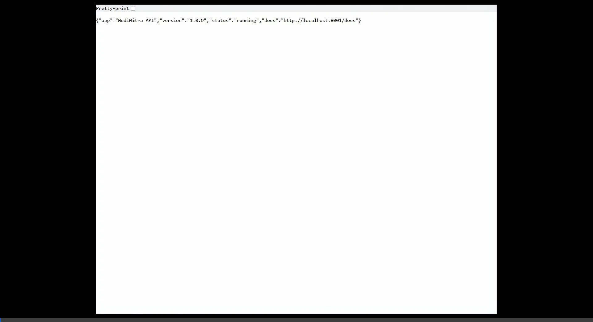

# 🏥 MediMitra — AI-Powered Health Intelligence Platform

<div align="center">


[](https://python.org)
[](https://fastapi.tiangolo.com)
[](https://console.groq.com)
[](https://developer.mozilla.org/en-US/docs/Web/HTML)
[](LICENSE)

### *Your AI Health Companion — Smarter, Personalized Healthcare for Every Indian*

**Built for FutureAI Global Hackathon 2026**

## 🚀 Deployment Links

| Service | URL |
|---------|-----|
| 🌐 **Live Demo** | [https://sagarswain-lab.github.io/MediMitra/medimitra-frontend/medimitra_spa.html](https://sagarswain-lab.github.io/MediMitra/medimitra-frontend/medimitra_spa.html) |
| 🔗 **Backend API** | [https://medimitra-api-05bj.onrender.com/](https://medimitra-api-05bj.onrender.com/) |
| 📖 **API Docs** | [https://medimitra-api-05bj.onrender.com/docs](https://medimitra-api-05bj.onrender.com/docs) |

<br/>



</div>

---

## 📌 Table of Contents

- [Problem Statement](#-problem-statement)
- [Solution Overview](#-solution-overview)
- [Key Features](#-key-features)
- [Personalization System](#-personalization-system)
- [Tech Stack](#-tech-stack)
- [System Architecture](#-system-architecture)
- [Installation & Setup](#-installation--setup)
- [Port Conflict Fix](#️-port-conflict-fix-important-for-judges)
- [How to Run](#-how-to-run)
- [API Endpoints](#-api-endpoints)
- [Project Structure](#-project-structure)
- [Technical Workflow](#-technical-workflow)
- [Team](#-team)

---

## 🎯 Problem Statement

India faces three critical overlapping health crises:

- **25%+ of drugs** sold in rural India are counterfeit or substandard
- Millions of patients receive prescriptions they **cannot read or understand** due to language barriers
- **Self-medication errors** cause thousands of hospitalizations yearly
- Rural populations have **zero access** to basic health literacy tools in their native language

Most existing health apps target urban, English-speaking users — leaving 700 million rural Indians underserved.

---

## 💡 Solution Overview

**MediMitra** is a comprehensive AI-powered health companion web application that bridges the healthcare literacy gap for Indian users. It combines 7 intelligent features into one seamless platform, with **optional Google Sign-In** that unlocks full personalization — every AI response is tailored to the user's medical profile.

> *"MediMitra" means "Health Friend" in Hindi/Odia — because everyone deserves a knowledgeable health companion.*

---

## ✨ Key Features

### 🤒 1. Symptom Checker
- Describe symptoms via text or **voice input**
- AI identifies possible conditions with confidence score, home remedies, and red flag warnings
- **⚡ SSE Streaming** — tokens stream word-by-word; first result visible in < 300 ms
- **Personalized** — signed-in users with profile get allergy/condition-aware analysis
- Supports **7 Indian languages**

### 📄 2. Prescription Reader
- Upload photo of handwritten or printed prescription
- OCR + AI explains each medicine in simple language with side effects
- **Patient warnings** — flags medicines conflicting with your allergies or conditions (if signed in)
- **Text-to-Speech** reads explanation aloud in your language
- Supports **7 Indian languages**

### ⚠️ 3. Drug Interaction Checker
- Enter multiple medicines via search or voice
- Checks dangerous combinations using **OpenFDA clinical data**
- Color-coded interaction matrix (Safe / Moderate / Dangerous)
- **Personalized warnings** based on your health profile

### 📸 4. Medicine Scanner
- Upload or capture medicine packaging photo
- AI verifies authenticity via **OpenFDA database** — Safety score 0–100
- **Suitability check** — tells if medicine is safe given your known conditions
- Verdict: Genuine / Suspicious / Counterfeit

### 🥗 5. Lifestyle Advisor
- **Auto-fills** name, age, height, weight, gender, conditions from your saved health profile
- AI generates complete **7-day diet + exercise + wellness plan**
- Tailored for Indian food preferences; avoids your allergens and condition-unsafe foods
- Downloadable as branded PDF; supports **7 Indian languages**

### 🌦️ 6. Seasonal Health Awareness
- Auto-detects user location via GPS
- Season-specific health alerts with disease risk cards, prevention tips, Do's & Don'ts
- **Personalized** — highlights risks relevant to your chronic conditions

### 📍 7. Nearby Healthcare Finder
- Real-time GPS location detection
- Finds actual hospitals, clinics, pharmacies via **Overpass API** (OpenStreetMap)
- Interactive map powered by **Leaflet.js** — filter by type and radius
- **Emergency contact** shown in results for signed-in users

---

## 🔐 Personalization System

MediMitra has two tiers — it works for everyone, but gets smarter when you sign in.

| Feature | Anonymous User | Signed-in User with Profile |
|---|---|---|
| Symptom Checker | Generic AI response | Flags allergens, accounts for conditions |
| Prescription Reader | Standard medicine info | ⚠️ Patient warnings for your allergies |
| Drug Interaction | Standard interaction check | Profile-aware risk assessment |
| Medicine Scanner | Authenticity check | Suitability check for your conditions |
| Lifestyle Advisor | Manual data entry | Auto-fills from profile, personalized plan |
| Seasonal Awareness | Generic alerts | Condition-specific risk highlighting |
| Nearby Healthcare | All results shown | Emergency contact included in results |

### Health Profile Fields
```
Personal:   Full name · Age · Gender · Blood group · Height · Weight (auto-BMI)
Medical:    Allergies · Chronic conditions · Current medications · Past surgeries
Emergency:  Contact name · Phone · Relationship
```

### How Personalization Works
1. User signs in with Google → JWT issued → profile saved to **SQLite**
2. On any feature request, backend calls `get_user_health_context()` from `memory_service.py`
3. Health context string is injected into the AI prompt
4. **Mem0** (optional) stores interaction history for cross-session memory
5. If not signed in — all features still work with generic AI responses

### Share Health Card (PDF)
- One-tap export of full health profile as a branded **ReportLab PDF**
- Includes personal info, allergies, conditions, medications, surgeries, emergency contact
- **User's Google profile picture** embedded in PDF header
- Share via Web Share API (Android/iOS) or browser download fallback

---

## 📊 Analytics & Feedback

### 💬 Integrated Feedback System
- Interactive star-rating and comment system built into the dashboard
- Persistent storage in **SQLite3** for continuous improvement
- Full-stack feedback loop with dedicated backend route

---

## 🛠️ Tech Stack

### Frontend
| Technology | Purpose |
|---|---|
| HTML5 + CSS3 + Vanilla JS | Single Page Application (SPA) — zero framework |
| `app.js` + `style.css` | All SPA logic, state management, design system |
| Leaflet.js + OpenStreetMap | Free interactive maps (no API key needed) |
| Web Speech API | Voice input & text-to-speech output |
| Google Identity Services | One-tap Google Sign-In, JWT sessions |
| Font Awesome | Icons |
| Sora + DM Sans (Google Fonts) | Typography |

### Backend
| Technology | Purpose |
|---|---|
| FastAPI (Python) | REST API framework |
| Groq Llama 3.3 70B | Text AI — symptoms, lifestyle, drug interaction |
| Google Gemini (gemini-3.5-flash) | Multimodal AI — prescription reader, medicine scanner |
| ReportLab | PDF generation (symptom reports, 7-day plans, health card with profile picture) |
| SQLite3 | Lightweight local database (users, profiles, history) |
| Pydantic v2 | Request/response validation with coercion validators |
| Mem0 | Persistent AI memory for cross-session personalization |
| Google OAuth2 | JWT-based auth via Google ID tokens |
| Pillow | Profile picture image processing for PDF embedding |
| Uvicorn | ASGI server |

### External APIs (All Free)
| API | Purpose | Key Required |
|---|---|---|
| Groq API | All AI responses (text + vision + streaming) | ✅ Free key |
| OpenFDA API | Drug verification & interaction data | ❌ No key |
| Overpass API | Real nearby places (hospitals, clinics) | ❌ No key |
| Google OAuth | User sign-in & profile picture | ✅ Free key |
| Mem0 API | Persistent user memory (optional) | ✅ Free key (optional) |

---

## 🏗️ System Architecture

```
┌─────────────────────────────────────────────────────────┐
│                    USER BROWSER                         │
│                                                         │
│  MediMitra SPA (HTML/CSS/JS)                            │
│  ┌──────────┐ ┌──────────┐ ┌──────────┐ ┌──────────┐    │
│  │ Symptom  │ │Prescript.│ │ Scanner  │ │ Profile  │    │
│  │ Checker  │ │  Reader  │ │          │ │ + Auth   │    │
│  └────┬─────┘ └────┬─────┘ └────┬─────┘ └────┬─────┘    │
│       │             │             │             │       │
│       └─────────────┴─────────────┴─────────────┘       │
│                           │                             │
│       JWT in Authorization header (optional auth)       │
└───────────────────────────┼─────────────────────────────┘
                            │
┌───────────────────────────▼─────────────────────────────┐
│                  FastAPI BACKEND                        │
│               (Deployed on Render)                      │
│                                                         │
│  ┌─────────┐ ┌──────────┐ ┌──────────┐ ┌──────────┐     │
│  │symptom  │ │prescriptn│ │lifestyle │ │  auth +  │     │
│  │.py      │ │.py       │ │.py       │ │ profile  │     │ 
│  └────┬────┘ └─────┬────┘ └─────┬────┘ └────┬─────┘     │
│       └─────────────┴─────────┬─┘            │          │
│                               │              │          │
│  ┌────────────────────────────▼──┐  ┌────────▼──────┐   │
│  │  memory_service.py            │  │  SQLite3 DB   │   │
│  │  get_user_health_context()    │  │  users        │   │
│  │  → injects profile into LLM  │  │  health_       │   │
│  │  store_profile_memory() Mem0  │  │  profiles     │   │
│  └───────────────────────────────┘  └───────────────┘   │
│                                                         │
│  ┌────────────────┐  ┌─────────────┐  ┌─────────────┐   │
│  │ llm_service.py │  │openfda_svc  │  │pdf_service  │   │
│  │ Groq wrapper   │  │drug data    │  │health card  │   │
│  │ text+vision+   │  │             │  │+ user pic   │   │
│  │ streaming      │  │             │  │             │   │
│  └────────────────┘  └─────────────┘  └─────────────┘   │
└─────────────────────────────────────────────────────────┘
```

---

## ⚙️ Installation & Setup

### Prerequisites
- Python 3.10 or higher
- pip (Python package manager)
- Any modern web browser (Chrome recommended)
- Internet connection (for AI API calls)

### Step 1 — Clone the Repository
```bash
git clone https://github.com/sagarswain-lab/MediMitra.git
cd MediMitra
```

### Step 2 — Install Backend Dependencies
```bash
cd medimitra-backend
pip install -r requirements.txt
```

### Step 3 — Environment Variables
Copy `.env.example` to `.env` and fill in your keys:

```env
# Required
GEMINI_API_KEY=your_gemini_key_here
GROQ_API_KEY=your_groq_key_here

# Required for Google Sign-In
GOOGLE_CLIENT_ID=your_google_client_id_here

# Optional — enables cross-session AI memory
MEM0_API_KEY=your_mem0_key_here
```

Get free keys from:
- **Groq** → https://console.groq.com
- **Google OAuth** → https://console.cloud.google.com (create OAuth 2.0 Client ID for Web)
- **Mem0** → https://app.mem0.ai (optional)

---

## ⚠️ Port Conflict Fix (Important for Judges)

If you previously ran another project using port `8001` or `5500`, those servers
may still be running in the background — even after closing the terminal window.

**Before running MediMitra, clear both ports first:**

### Windows
```cmd
for /f "tokens=5" %a in ('netstat -ano ^| findstr :8001') do taskkill /PID %a /F
for /f "tokens=5" %a in ('netstat -ano ^| findstr :5500') do taskkill /PID %a /F
```

### macOS / Linux
```bash
lsof -ti :8001 | xargs kill -9
lsof -ti :5500 | xargs kill -9
```

> 💡 **Tip:** Always press `Ctrl+C` in the terminal before closing it to gracefully stop the server.

---

## 🚀 How to Run

### Terminal 1 — Start Backend
```bash
cd medimitra-backend
pip install -r requirements.txt
python run_backend.py
```

You should see:
```
Starting MediMitra Backend on port 8001...
MediMitra API running on http://localhost:8001
INFO: Application startup complete.
```

### Terminal 2 — Start Frontend
```bash
cd medimitra-frontend
python run_frontend.py
```

You should see:
```
MediMitra Frontend running at http://localhost:5500/medimitra_spa.html
Opening browser automatically...
```

### Access Points
| Service | URL |
|---|---|
| 🌐 Web App | http://localhost:5500/medimitra_spa.html |
| 📖 API Docs | http://localhost:8001/docs |
| ❤️ Health Check | http://localhost:8001/health |

---

## 📡 API Endpoints

All endpoints available at `http://localhost:8001` (local) or `https://medimitra-api-05bj.onrender.com/` (deployed).

Auth is **optional** on all feature endpoints — anonymous users get generic responses, signed-in users with a saved profile get personalized AI responses.

| Method | Endpoint | Feature | Auth | Description |
|---|---|---|---|---|
| POST | `/api/symptom/check` | Symptom Checker | Optional | Analyze symptoms, return full JSON diagnosis |
| POST | `/api/symptom/stream` | Symptom Checker | Optional | ⚡ Stream AI tokens live via SSE |
| POST | `/api/symptom/download-pdf` | Symptom Report | Optional | Download branded PDF of symptom analysis |
| POST | `/api/prescription/read` | Prescription Reader | Optional | Extract and explain prescription medicines |
| POST | `/api/interaction/check` | Drug Interaction | Optional | Check interactions between medicines |
| POST | `/api/scanner/verify` | Medicine Scanner | Optional | Verify medicine authenticity via OpenFDA |
| POST | `/api/lifestyle/plan` | Lifestyle Advisor | Optional | Generate personalized 7-day wellness plan |
| POST | `/api/lifestyle/download-pdf` | Lifestyle Report | Optional | Download branded 7-day plan PDF |
| POST | `/api/seasonal/alerts` | Seasonal Awareness | Optional | Get seasonal health alerts by location |
| POST | `/api/nearby/find` | Nearby Healthcare | Optional | Find hospitals/clinics/pharmacies nearby |
| POST | `/api/feedback/submit` | User Feedback | None | Submit user rating and comments |
| POST | `/api/auth/google` | Authentication | None | Verify Google ID token, return JWT |
| GET | `/api/auth/me` | Authentication | Required | Validate JWT, return current user info |
| GET | `/api/auth/config` | Auth Config | None | Return Google Client ID for frontend |
| GET | `/api/profile/me` | Health Profile | Required | Get authenticated user's health profile |
| PUT | `/api/profile/me` | Health Profile | Required | Create or update health profile |
| GET | `/api/profile/health-card-pdf` | Health Card | Required | Generate & download health card PDF with profile picture |
| GET | `/docs` | API Docs | None | Interactive Swagger documentation |
| GET | `/health` | Health Check | None | Server status |

### Sample Request — Symptom Checker (with auth)
```json
POST /api/symptom/check
Authorization: Bearer <jwt>

{
  "symptoms": "fever since 2 days, headache, body pain",
  "duration": "1-3 days",
  "severity": "6",
  "language": "Hindi",
  "user_id": "42"
}
```

### Sample Response (personalized)
```json
{
  "condition": "Viral Fever",
  "severity": "Moderate",
  "confidence": 82,
  "explanation": "⚠️ Note: You are allergic to Aspirin — avoid it for fever. यह एक सामान्य वायरल बुखार प्रतीत होता है...",
  "home_remedies": ["आराम करें और पानी पियें", "..."],
  "red_flags": ["3 दिनों से अधिक बुखार", "..."]
}
```

---

## 📁 Project Structure

```
MediMitra/
│
├── 📁 medimitra-backend/
│   ├── 📄 main.py                  # App entry, CORS, route registration
│   ├── 📄 database.py              # SQLite3 setup, init_db(), migrations
│   ├── 📄 auth_utils.py            # JWT verify, get_current_user, get_optional_user
│   ├── 📄 requirements.txt         # Python dependencies
│   ├── 📄 run_backend.py           # Easy start script
│   ├── 📄 .env                     # API keys (Groq, Mem0, Google)
│   │
│   ├── 📁 routes/
│   │   ├── 📄 auth.py              # Google OAuth + JWT + /me endpoint
│   │   ├── 📄 profile.py           # Health profile CRUD + health-card-pdf
│   │   ├── 📄 symptom.py           # Symptom checker + SSE stream + optional auth
│   │   ├── 📄 prescription.py      # Prescription reader + patient_warning
│   │   ├── 📄 interaction.py       # Drug interaction + profile context
│   │   ├── 📄 scanner.py           # Medicine scanner + suitability check
│   │   ├── 📄 lifestyle.py         # Lifestyle advisor + profile auto-fill data
│   │   ├── 📄 seasonal.py          # Seasonal alerts + condition-aware
│   │   ├── 📄 nearby.py            # Nearby healthcare + emergency contact
│   │   └── 📄 feedback.py          # User feedback
│   │
│   ├── 📁 services/
│   │   ├── 📄 llm_service.py       # Groq SDK wrapper (text + vision + streaming)
│   │   ├── 📄 memory_service.py    # get_user_health_context() + Mem0 store
│   │   ├── 📄 pdf_service.py       # ReportLab PDFs — symptom, lifestyle, health card
│   │   ├── 📄 openfda_service.py   # OpenFDA drug database queries
│   │   └── 📄 overpass_service.py  # Overpass/OpenStreetMap API
│   │
│   └── 📁 models/
│       └── 📄 schemas.py           # Pydantic v2 models — all request/response types
│
├── 📁 medimitra-frontend/
│   ├── 📄 medimitra_spa.html       # Complete SPA — all sections, landing page
│   ├── 📄 app.js                   # All JS: state, API calls, auth, profile, i18n
│   ├── 📄 style.css                # Full design system, animations, responsive
│   └── 📄 run_frontend.py          # Easy start script (auto-opens browser)
│
└── 📄 README.md
```

---

## 🔄 Technical Workflow

### Personalized AI Response Flow
```
User submits feature request (e.g. symptom check)
        ↓
Frontend sends JWT in Authorization header (if signed in)
        ↓
FastAPI → get_optional_user() extracts user_id (or None)
        ↓
        ├── Anonymous → generic AI prompt
        └── Signed in → get_user_health_context(user_id)
                              ↓
                        Reads health_profiles from SQLite
                        Builds context string:
                        "Patient: 19yo Male, Blood: O+
                         Allergies: Milk, Peanuts
                         Conditions: Diabetes, High BP
                         Medications: Metformin 500mg
                         Surgeries: None"
                              ↓
                        Mem0 fetches past interaction memories
                              ↓
                        Context injected into LLM system prompt
        ↓
Groq Llama 3.3 generates personalized response
        ↓
Result stored to SQLite + Mem0 memory
        ↓
Frontend renders personalized result with patient warnings
```

### SSE Streaming (Symptom Checker)
```
POST /api/symptom/stream
        ↓
Groq stream=True → tokens yield one by one
        ↓
SSE events: "data: <token>\n\n"
        ↓
Frontend ReadableStream reader appends tokens live
        ↓
[DONE] event → full JSON parsed → result card rendered
        ↓
Fallback: if stream fails → auto-retry /api/symptom/check
```

### Health Card PDF Generation
```
GET /api/profile/health-card-pdf  (JWT required)
        ↓
Fetch health_profile from SQLite
Fetch user.picture URL from users table
        ↓
pdf_service.generate_health_card_pdf(profile, picture_url)
        ↓
requests.get(picture_url) → Pillow resize 60x60 → JPEG buffer
ReportLab embeds image in PDF header beside MediMitra logo
        ↓
Sections: Personal Info · Allergies · Conditions
          Medications · Surgeries · Emergency Contact
        ↓
StreamingResponse → browser download / Web Share API
```

---

## 🌟 Innovation Highlights

| Feature | Innovation |
|---|---|
| **⚡ SSE Streaming** | Groq tokens stream live — first word visible in < 300 ms |
| **🔐 Optional Auth** | All 7 features work without login; signing in unlocks full personalization |
| **🧠 Profile Injection** | SQLite health profile injected into every AI prompt when signed in |
| **👤 Health Card PDF** | User's Google profile picture embedded in PDF via Pillow + ReportLab |
| **🚨 Emergency Button** | Tap-to-call 112/108 + GPS-based "Navigate to Nearest Hospital" |
| **📋 Patient Warnings** | Prescription and scanner results flag medicines unsafe for *your* conditions |
| **🔄 Lifestyle Auto-fill** | Lifestyle Advisor auto-fills from saved profile on section load |
| **📄 Multilingual PDFs** | ReportLab PDFs render Hindi/Bengali/Tamil/Telugu/Odia/Marathi natively |
| **🌐 Full UI Translation** | Language switch instantly translates all nav, labels, buttons, card text |
| **🔑 Groq Key Rotation** | Multiple GROQ API keys — auto-rotates on rate limit |
| **🗺️ Free Maps** | Leaflet + OpenStreetMap — zero cost, real OSM data |
| **💊 Free Drug Data** | OpenFDA API — no key, real clinical interaction data |
| **🎙️ Voice Input** | Web Speech API for symptom description and medicine entry |
| **📱 Responsive UI** | Mobile-first design, works on all screen sizes |
| **💾 Offline History** | localStorage history — works without backend |

---

## 📊 Judging Criteria Alignment

| Criteria | How MediMitra Addresses It |
|---|---|
| **Functionality** | 7 fully working AI features + auth + profile + health card PDF |
| **Code Quality** | Modular routes/services, Pydantic v2 validation, clean separation of concerns |
| **Scalability** | FastAPI + SQLite easily upgrades to PostgreSQL; stateless routes; optional Mem0 |
| **Innovation** | Personalized AI via profile injection · Health card PDF with user picture · Emergency navigation |
| **Social Impact** | Targets rural India's health literacy gap in 7 Indian languages, free to use |

---

## 🧪 Automated Testing with Keploy

MediMitra includes automated API regression tests using **Keploy**.

### Run Tests
```bash
make test-api
```
Or directly:
```bash
cd medimitra-backend
keploy test -c "python run_backend.py"
```

### Record New Test Cases
```bash
cd medimitra-backend
keploy record -c "python run_backend.py"
```
Interact with the app or Swagger UI — Keploy captures traffic and generates YAML test cases under `medimitra-backend/keploy/tests/`.

---

## 🩺 Medical Disclaimer

> MediMitra provides AI-generated health information for **educational purposes only**. It is **NOT** a substitute for professional medical advice, diagnosis, or treatment. Always consult a licensed healthcare professional for medical concerns.

---

## 👨‍💻 Team

**Team Name:** SuperNova
| Name | Role |
|---|---|
| **Sagar Swain** | Backend Developer |
| **Aavash Kumar Beriha** | Frontend Developer |
| **Om Rudra Prakash** | Supportive Backend Developer |
| **Anup Kumar Sahoo** | Presentation & Documentation |

**Institution:** ITER — SOA

---

## 📄 License

This project is licensed under the MIT License.

---

<div align="center">

**Built with ❤️ by team SuperNova 2026**

*MediMitra — Because every Indian deserves a health companion in their own language*

</div>
